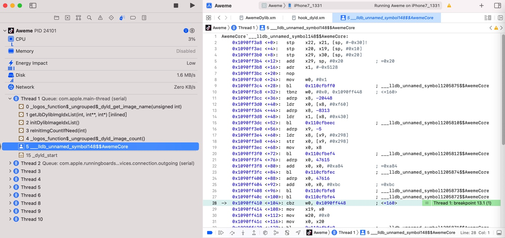

# 箭头指向的指令

当调试时，代码停下来时，会看到的汇编代码中的有个：`箭头`=`->`

而`->` 指向的是**将要运行**的指令代码，不是当前**正在运行**的代码

举例：



```nasm
AwemeCore`___lldb_unnamed_symbol148$$AwemeCore:
。。。
    0x1090ff404 <+92>:  add    x0, x0, #0xbc             ; =0xbc 
    0x1090ff408 <+96>:  bl     0x110cfbfe8              ; ___lldb_unnamed_symbol1205873$$AwemeCore
    0x1090ff40c <+100>: bl     0x110cfbfe4              ; ___lldb_unnamed_symbol1205872$$AwemeCore
->  0x1090ff410 <+104>: cbz    w0, 0x1090ff448          ; <+160>
```

当前 `->` 指向的：

```nasm
->  0x1090ff410 <+104>: cbz    w0, 0x1090ff448          ; <+160>
```

是 **将要运行的** 下一行的代码=指令

而当前正在运行的指令，对应着箭头`->`的上面的一行：

```nasm
0x1090ff40c <+100>: bl     0x110cfbfe4              ; ___lldb_unnamed_symbol1205872$$AwemeCore
```
