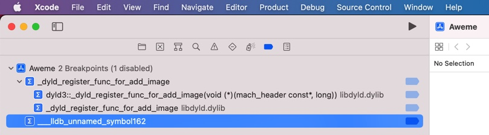
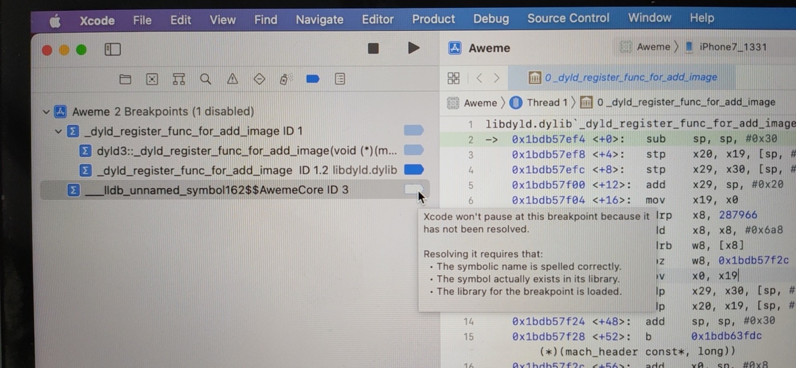
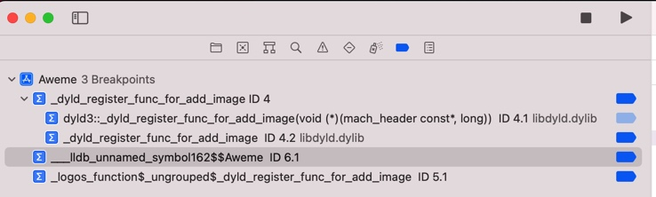
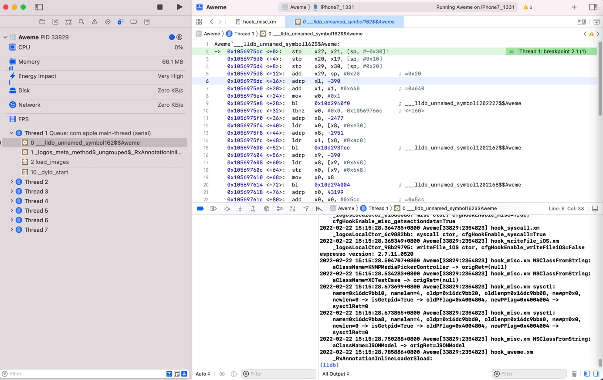
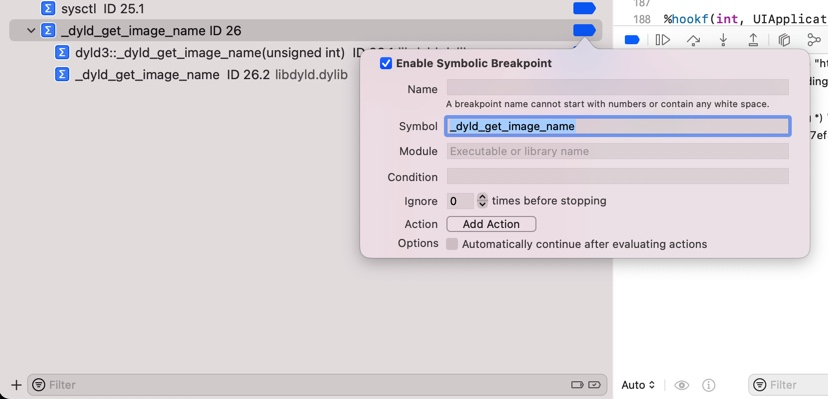
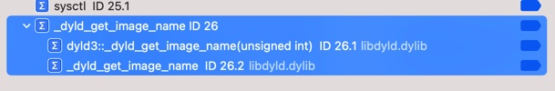
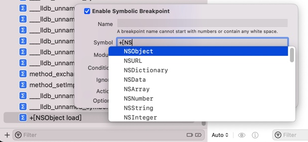
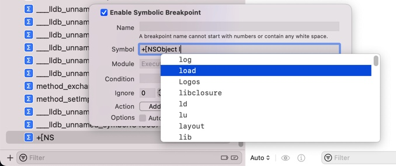
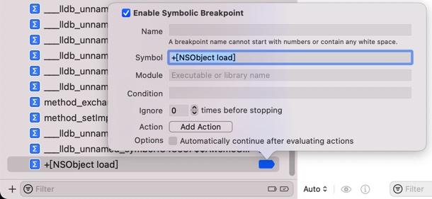

# 断点

## 调试加断点时函数名要准确，否则加不上

想要给函数

`___lldb_unnamed_symbol162`

加上断点：



后来发现，前面的写法是错误的

应该改为：

`___lldb_unnamed_symbol162$$AwemeCore`

不过然后又发现，好像没有生效

且对于为何没有生效，还有额外的提示：

```bash
Xcode won't pause at this breakpoint because it has not been resolved.
Resolving it requires that:
The symbolic name is spelled correctly.
The symbol actually exists in its library.
The library for the breakpoint is loaded.
```



再然后发现是：

是函数所属的二进制弄错了

应该改为：

`___lldb_unnamed_symbol162$$Aweme`



就正确了。

后续断点才能正常生效：



## 添加符号断点时，会自动搜索到匹配的函数

给Xcode添加符号断点：

`_dyld_get_image_name`



回车确认后发现：

自动会出现2个（子）断点：

* `dyld3::_dyld_get_image_name(unsigned int) ID 26.1 libdyld.dylib`
* `_dyld_get_image_name ID 26.2 libdyld.dylib`



看起来好像是：

会根据当前符号，自动去寻找匹配到的函数

效果不错。

## 自动补全

Xcode中添加断点的输入框中，竟然也支持自动补全

折腾：

【未解决】研究抖音越狱检测逻辑：NSObject的load

期间，发现个心得：

Xcode的符号断点的输入框中，也支持 动态匹配 自动补全：





输入完后的效果：


