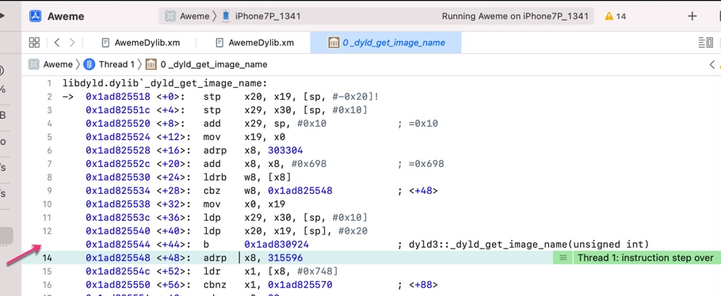
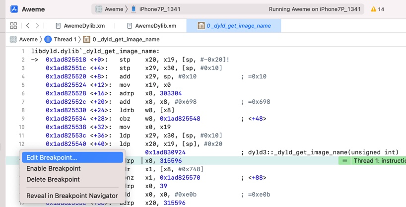
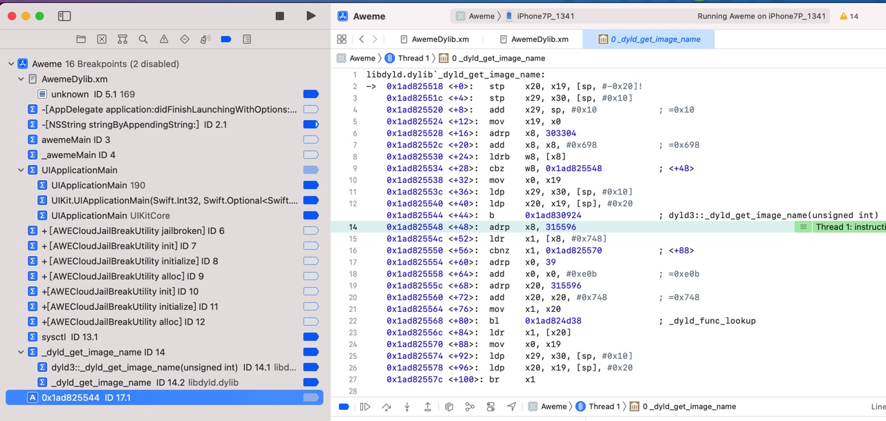

# 给汇编加断点

TODO：

* 【未解决】Xcode中给iOS的ObjC的ARM汇编代码加上带条件判断执行的断点

---

给汇编加断点

调试二进制 = ARM汇编代码，可以给汇编加上断点：

其实本身很简答：点击每行的最左边，即可加断点

只不过有个小缺点，有时候是个大缺点：由于断点开启后，该行最左边会加上白色背景，但是本身界面就是白色背景，导致：你根本不知道自己加了断点

只有仔细看，才能看出来：此时的行号没了

然后此时右键，能看到断点相关菜单功能，也才能，确认的确加了断点

举例：

点击行号`13`，可以加上 汇编代码的断点：

此时`13`的行号，就看不见了：

但是可以右键发现是加了断点的：

另外，切换到断点类别中的断点列表，也能看到新的 汇编代码 的断点：

此处断点名就是：地址：

`0x1ad825544`
