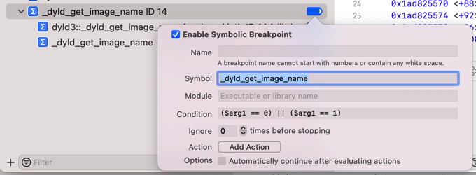

# 条件判断

TODO：

* 【已解决】XCode中如何给符号断点加上判断条件
* 【未解决】通过XCode给stringByAppendingString加断点调试寻找抖音崩溃原因
* 【已解决】XCode调试抖音ipa：给用Logos去hook的函数_dyld_get_image_name加符号断点

---

* 举例
  * Symbol: `_dyld_get_image_name`
    * Condition: `($arg1 == 0) || ($arg1 == 1)`
      * 
