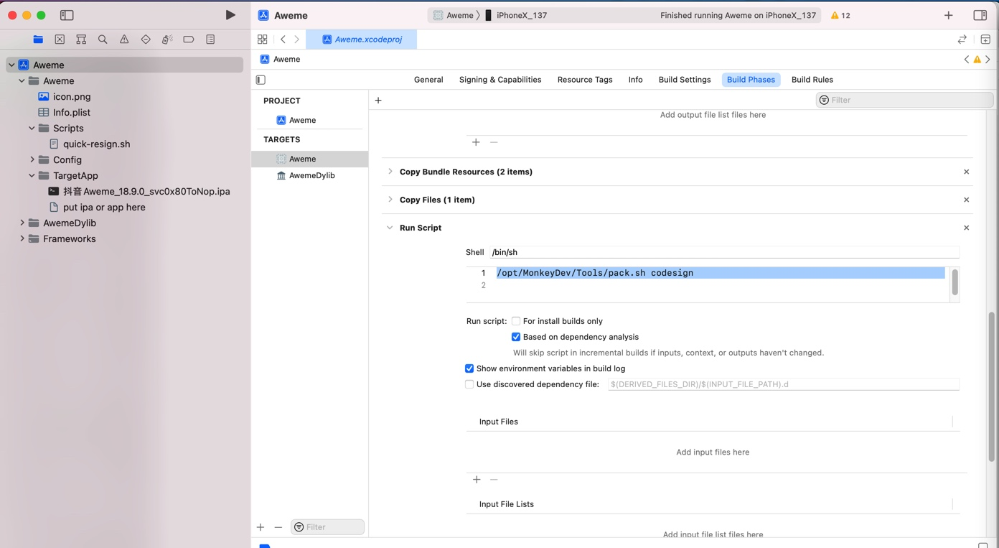
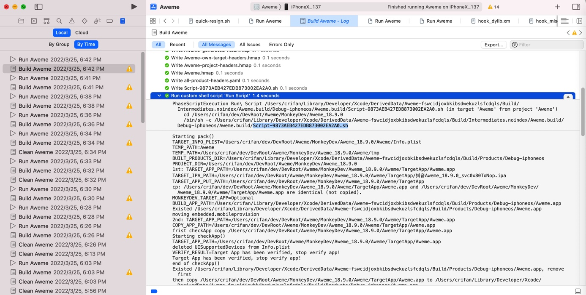

# Build Phases

## Run Script

Run Script对应着Build中的Script-xxx.sh

`Xcode`->`Target`->`Build Phases`->`Run Script`

其中输入的要运行的脚本代码

`/opt/MonkeyDev/Tools/pack.sh`



->最终对应着：

Build日志中的：

* `Script-9873AEB427EDB873002EA2A0.sh`
  * 完整路径：`/Users/crifan/Library/Developer/Xcode/DerivedData/Aweme-fswcidjoxbkibsdwekuzlsfcdqls/Build/Intermediates.noindex/Aweme.build/Debug-iphoneos/Aweme.build/Script-9873AEB427EDB873002EA2A0.sh`
  * 脚本内容是：
    ```bash
    #!/bin/sh
    /opt/MonkeyDev/Tools/pack.sh
    ```
  * 对应的运行脚本的命令是
    ```bash
    PhaseScriptExecution Run\ Script /Users/crifan/Library/Developer/Xcode/DerivedData/Aweme-fswcidjoxbkibsdwekuzlsfcdqls/Build/Intermediates.noindex/Aweme.build/Debug-iphoneos/Aweme.build/Script-9873AEB427EDB873002EA2A0.sh (in target 'Aweme' from project 'Aweme')
        cd /Users/crifan/dev/DevRoot/Aweme/MonkeyDev/Aweme_18.9.0
        /bin/sh -c /Users/crifan/Library/Developer/Xcode/DerivedData/Aweme-fswcidjoxbkibsdwekuzlsfcdqls/Build/Intermediates.noindex/Aweme.build/Debug-iphoneos/Aweme.build/Script-9873AEB427EDB873002EA2A0.sh
    ```
    * 
