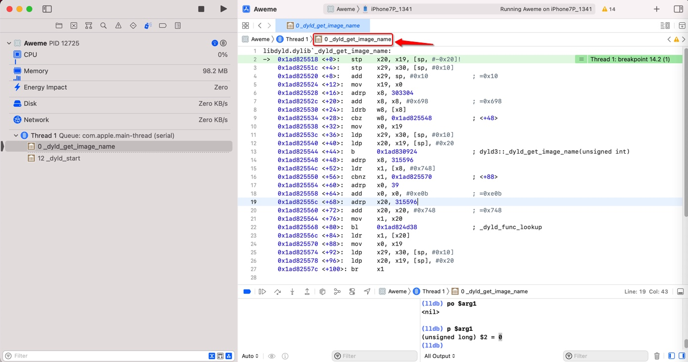
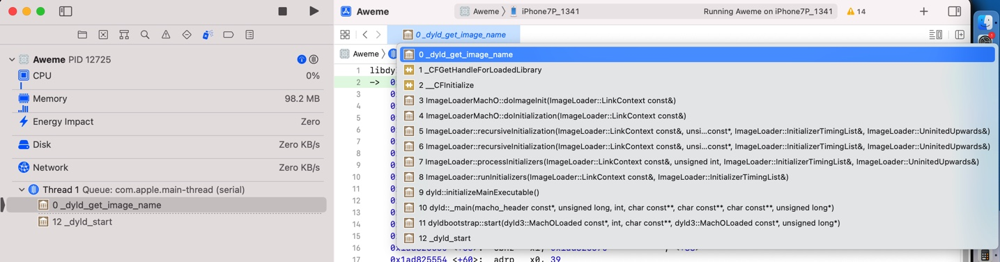
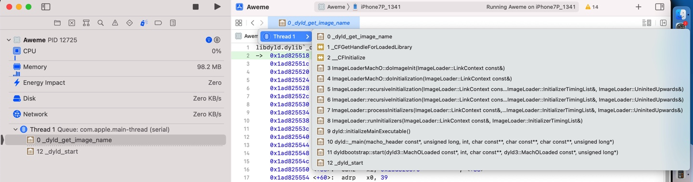
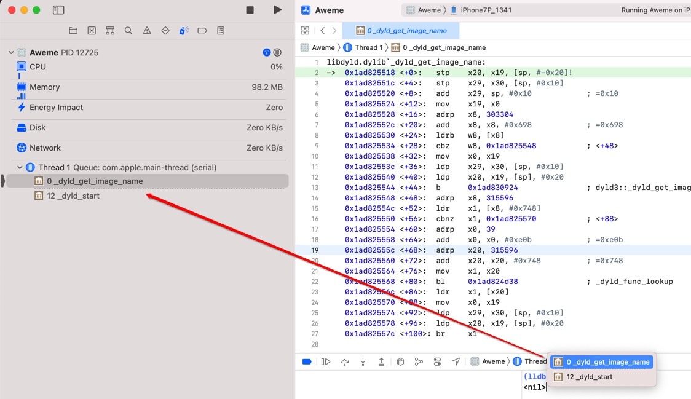
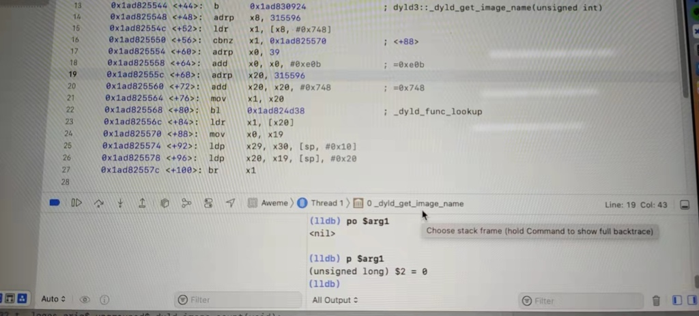
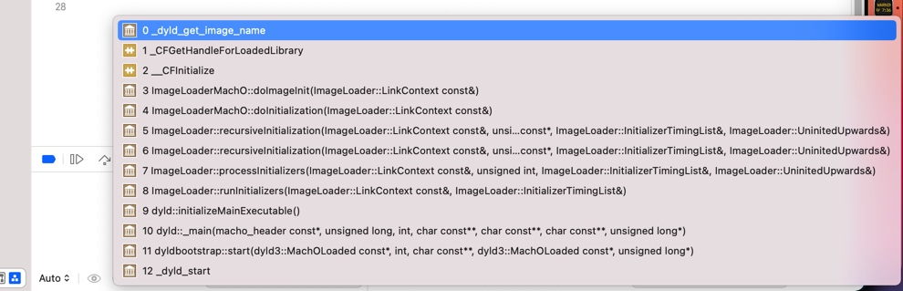

# 函数调用堆栈

点击顶部函数名查看函数调用顺序=函数调用堆栈

无意间发现：

点击 调试界面的顶部的 App名字同行的位置的 最后的`函数名`：

可以列出：函数调用顺序 = 函数调用堆栈：

-》方便调试。

类似的，点击`Thread`也可以列出函数：

-》看来是：

方便直接切换到不同的代码执行的地方：

* `App`
  * `Thread`
    * `Function`

另外：

调试界面的底部：

直接点击，会显示出：

和调试左上角列出的一样的，只有2个函数：

后来发现：

鼠标移动上去，会提示：

`Choose stack frame (hold Command to show full backtrace)`

然后试试：

`Command + 点击`

可以出现和前面一样的，完整的，函数调用堆栈：

-》然后也知道了：

* `函数调用堆栈`
  * 英文专业叫法：`backtrace`
    * 此处是`完整的backtrace`，所以叫：`full backtrace`
    * 所以LLDB调试 函数调用堆栈 缩写是：
      * `bt` = `backtrace`
