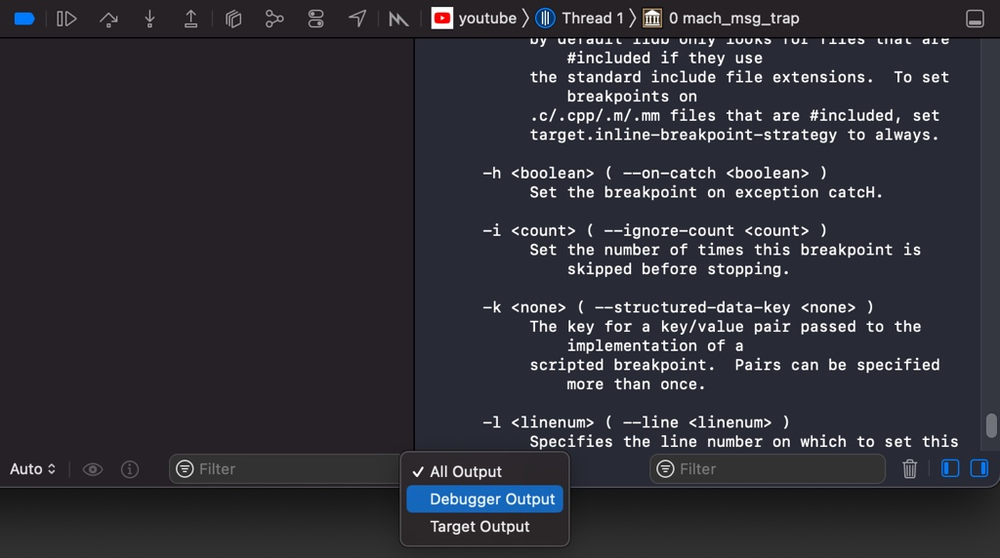

# 日志输出

## 调试区中log日志输出为空

* 现象

偶尔遇到过，调试区中，输出log的地方是空白 = 所有日志都没有输出 = 看不到日志

* 原因

后来发现是，之前某次不小心，把默认的 `All Output`改为了其他的选项了，比如`Debugger Output`或`Target Output`

* 解决办法

改回默认的`All Output`，即可正常看到全部log了。
