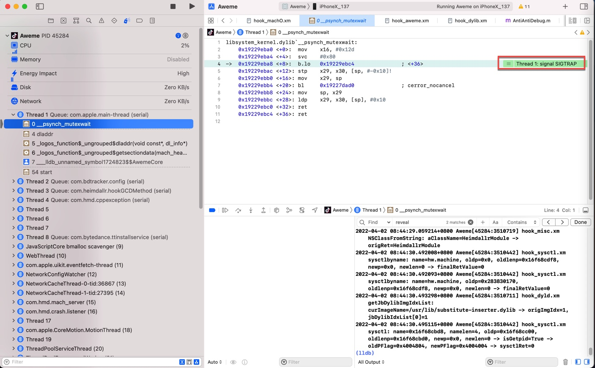
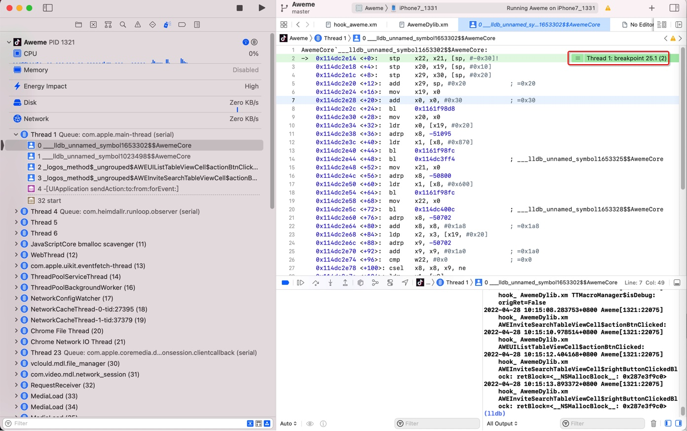
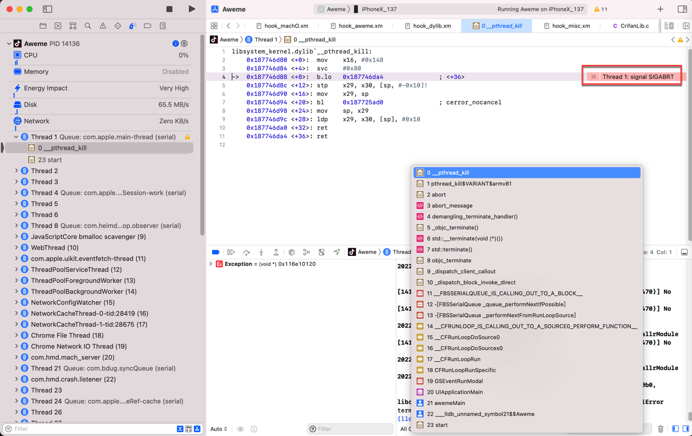
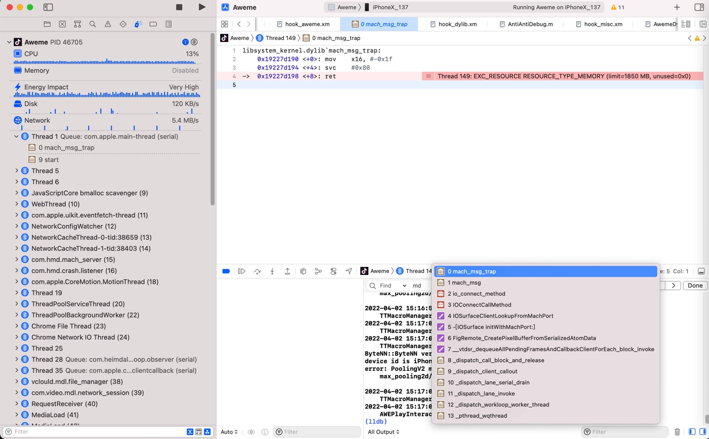
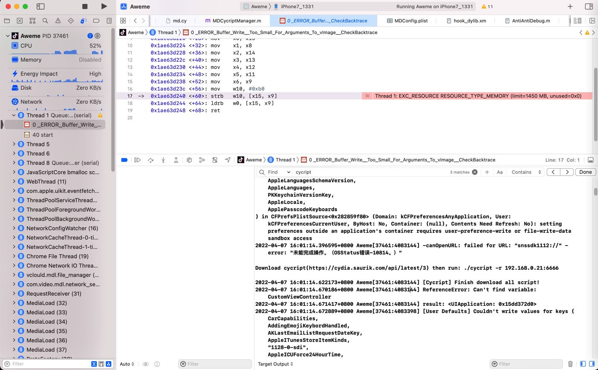

# 停下来的原因

Xcode代码停下来，会显示具体原因

用Xcode去调试程序时：

代码有时候会停下来 暂定运行

此时可以看出对应的代码停下来的原因：

* SIGTRAP：进入了某个trap 陷阱？ 触发了某个条件而进入了陷阱？
  * 
* breakpoint = 之前自己设置的某个断点，生效了，触发了某个断点，导致代码停下来
  * 
* SIGABRT=abort终止 = 发生了某些异常导致程序终止
  * 
* 异常：
  * EXC_RESOURCE RESOURCE_TYPE_MEMORY
    * Thread 149: EXC_RESOURCE RESOURCE_TYPE_MEMORY (limit=1850 MB, unused=0x0)
      * 
    * Thread 1: EXC_RESOURCE RESOURCE_TYPE_MEMORY (limit=1450 MB, unused=0x0)
      * 
* 等等

总之：

Xcode调试期间，代码停下来，一般会显示对应的原因的。
