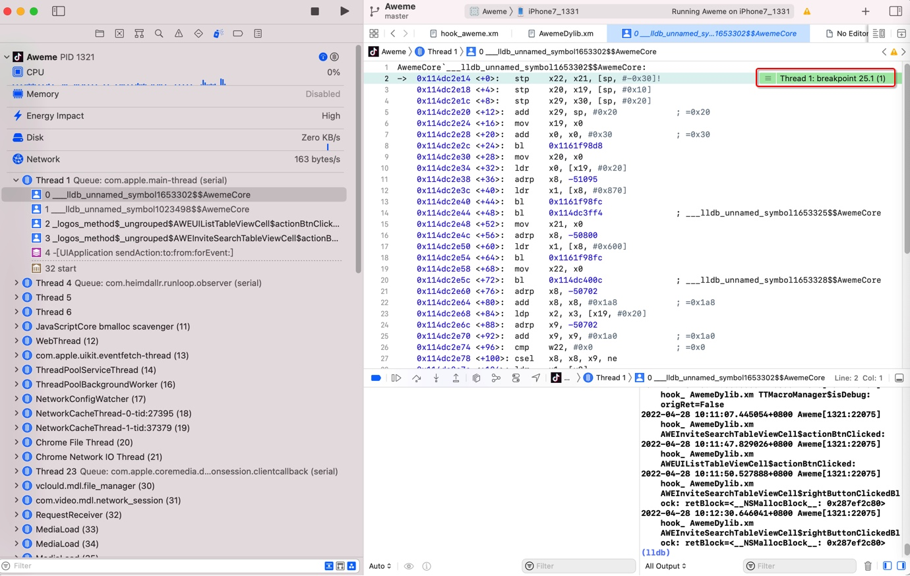
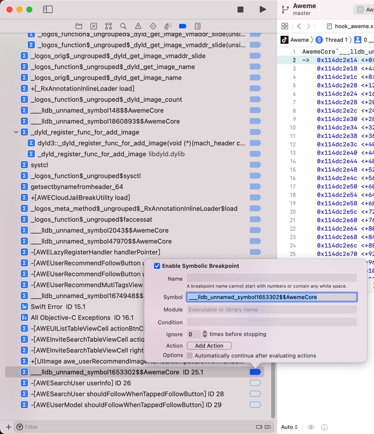
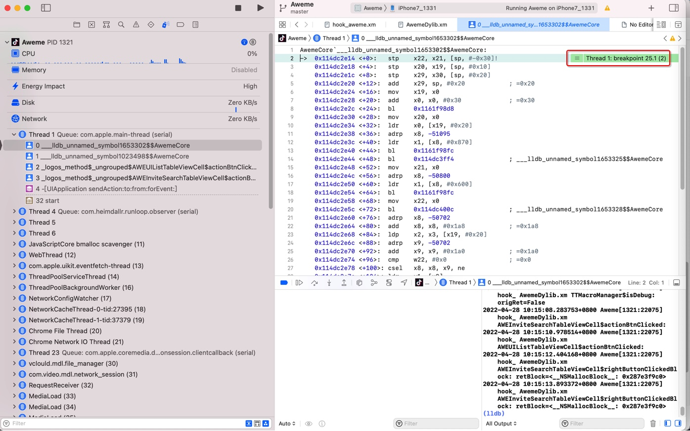

# 断点触发详情

Xcode触发断点时 还带提示第几次触发

举例：

断点触发到 `___lldb_unnamed_symbol1653302$$AwemeCore` 时，显示的：

`Thread 1: breakpoint 25.1 (1)`

表示：

* 所属线程：Thread 1
* 代码停下原因：断点breakpoint
* 具体是哪个断点：25.1
  * 切换到断点列表中可以看到是：
    * 
      * 对应着是自己加的符号断点
        * ___lldb_unnamed_symbol1653302$$AwemeCore
* (1)：表示此处断点触发了第一次
  * 后续如果再次触发，数字会依次增加，比如 `(2)`、`(3)`等等
    * 
