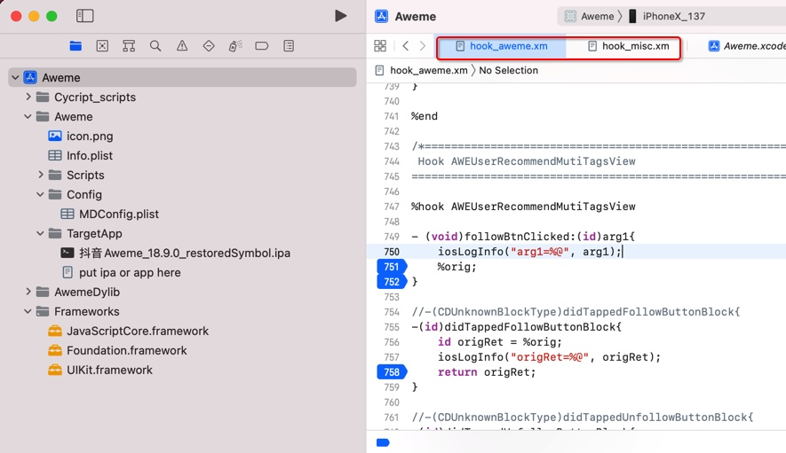
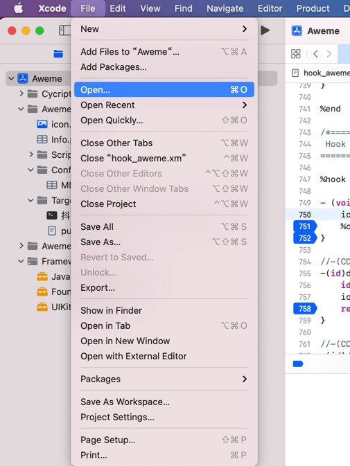
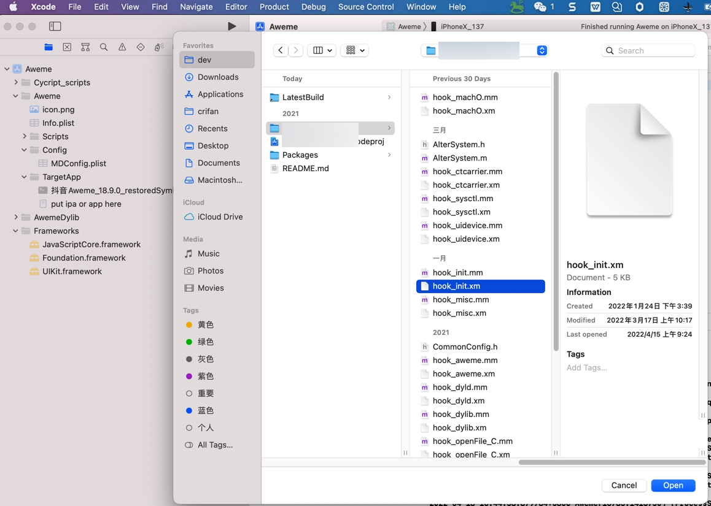
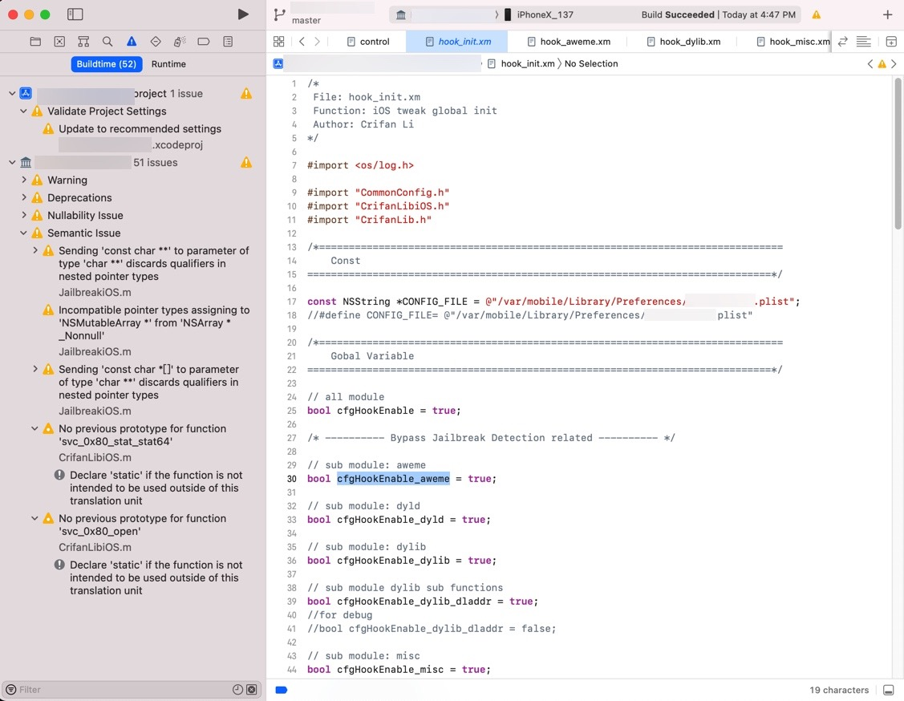
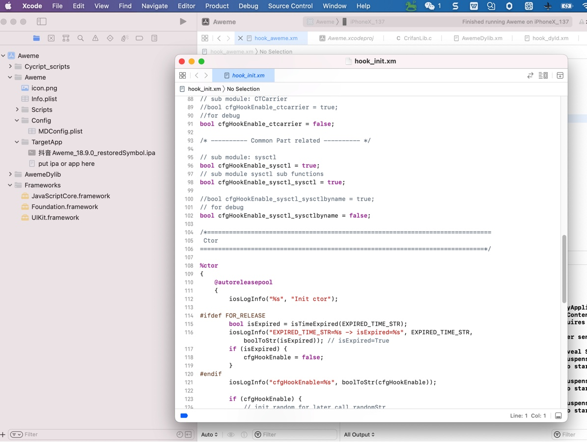
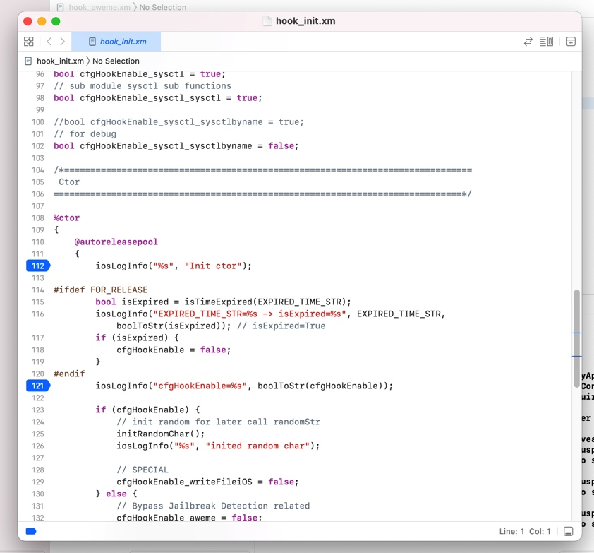

# 其他

## 可以通过打开文件，打开另外一个项目中的文件

之前调试抖音的Xcode项目，期间会触发断点运行到，另外一个插件的代码

所以之前是当前Xcode项目自动打开了另外项目中的文件：

此处是希望继续保持的状态。

另外也担心不小心关闭掉了打开的文件，好像就没机会再去打开到对应代码文件了？

比如想要添加新的断点，然后就不方便再去重新找到另外项目中的代码文件，再去新增断点

后来突然想到：

其实可以通过Xcode中的，打开文件，的功能，去打开，任何位置，包括别的Xcode项目中的文件的

去试试，此处故意去打开一个，之前没有打开的文件：

`hook_init.xm`

但是竟然是跳转到：另外该Xcode项目中了

而此处，当前Xcode项目中，并没有打开。

那故意把另外的Xcode项目关闭后，再去试试

会弹框显示，单独显示

然后继续去试了试，发现也是可以单独加断点的：

-》基本上满足了我们的要求：

Xcode的A项目中，打开B项目中的文件

用途是：

A项目中的Xcode部分断点，会触发B项目中的文件的代码生效，用于调试查看B项目源码运行情况

注：B项目编译期间，是保留了`symbol`的，所以是有机会源码调试的。
