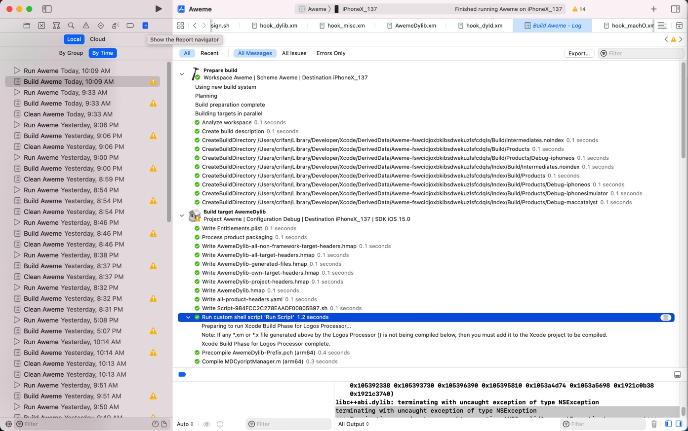
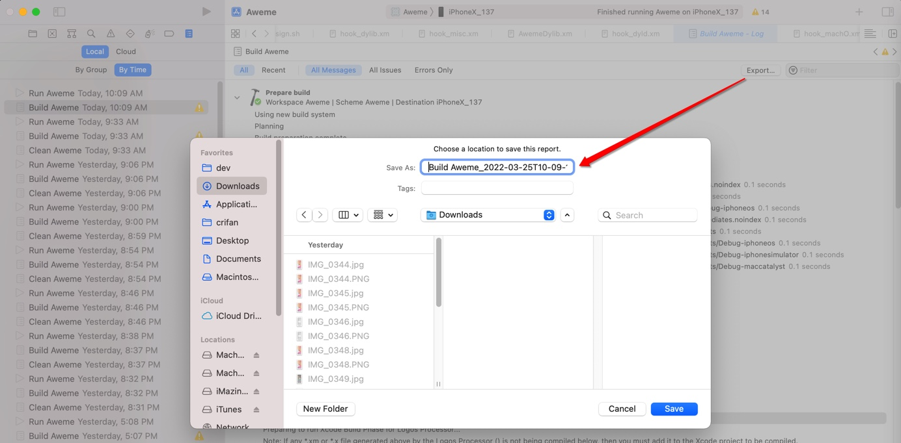
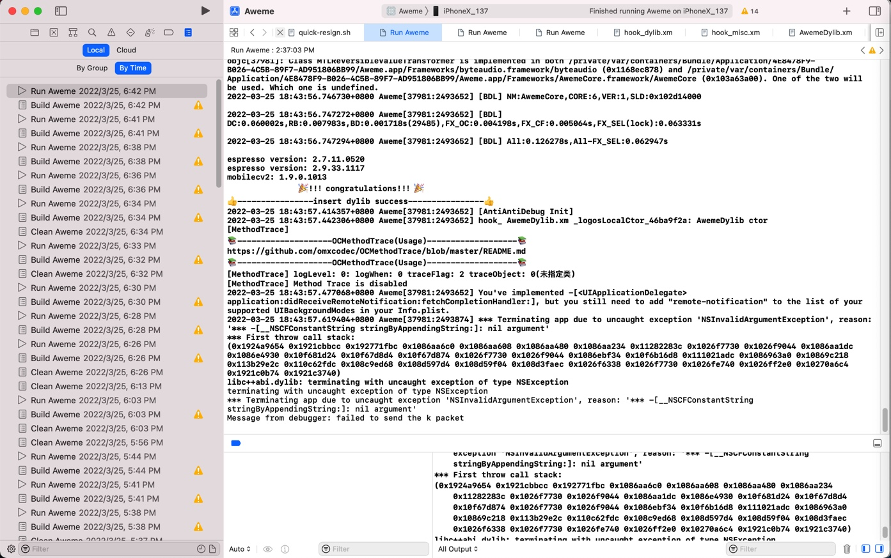

# Report Navigator

## 对于项目的编译和运行的详细过程，可以通过Report navigator中查看

`Xcode`->`Show the Report navigator`-> 点击对应`Build`或`Run`->右边即可显示出编译或运行的详细过程log日志

* Build
  * 举例
    * 
  * 导出：点击`Export`导出`txt`格式的日志
    * 
* Run
  * 举例
    * 
  * 导出：全选 -> 复制 -> 粘贴导出

TODO：

【已解决】XCode项目的编译链接安装等内部详细日志和过程
