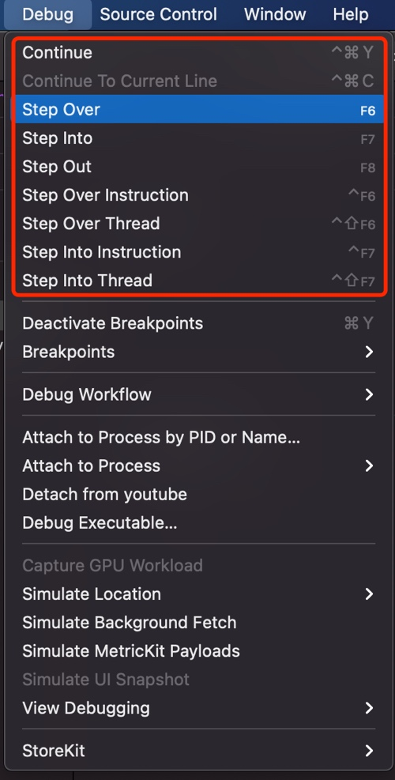

# 快捷键

## Xcode调试相关快捷键

* Xcode调试时的相关快捷键
  * 文字
    * `Step Over`: `F6`
      * `Step Over Instruction`: `Ctrl+F6`
      * `Step Over Thread`: `Ctrl+Shift+F6`
    * `Step Into`: `F7`
      * `Step Into Instruction`: `Ctrl+F7`
      * `Step Into Thread`: `Ctrl+Shift+F7`
    * `Step Out`: `F8`
  * 图
    * 

## F7无效

Mac中此处Xcode调试的单步进入的快捷键：F7 无效

发现是被其他占用了。

经过查找发现是旧版有道词典占用的。

解决办法：

* 彻底卸载旧版有道词典
  * 因为即使没开启 取词和划词 也会占用F7快捷键
* 卸载旧版，安装新版有道词典
  * 没开启取词划词，就不会占用（F7等）快捷键
