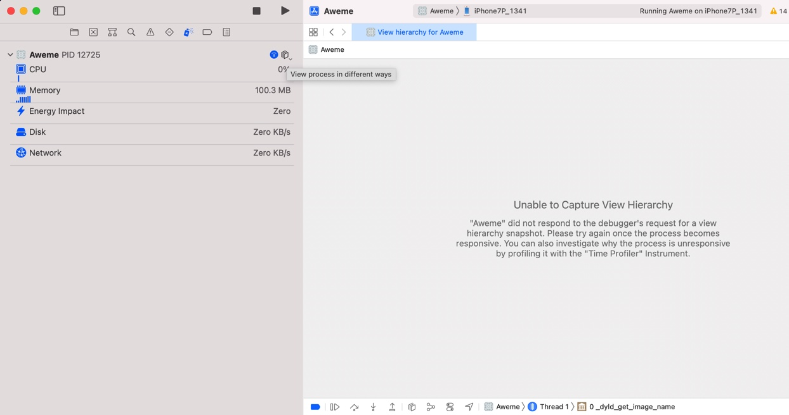
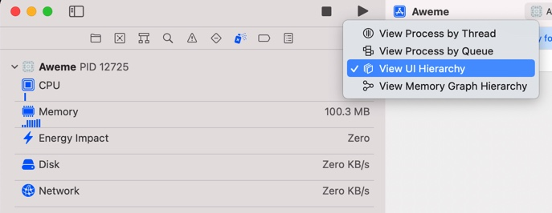
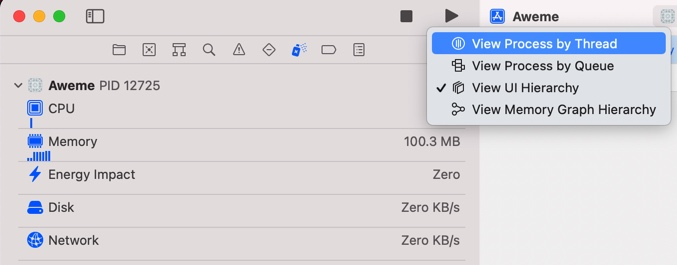
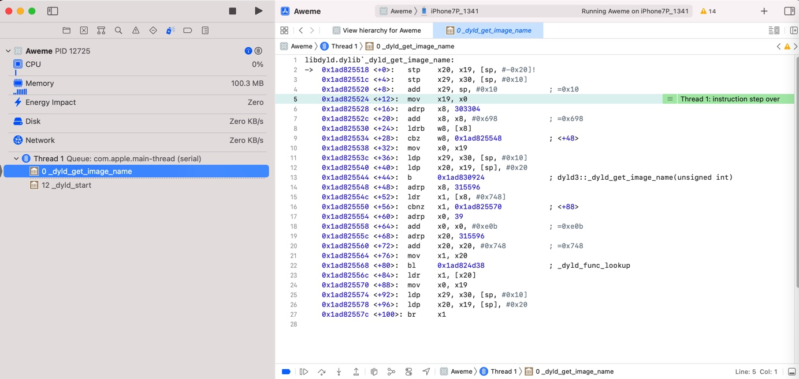

# 切换进程视图

在不同视图之间切换：

在调试期间，新点击了：

* `Debug Memory Graph`
* `Debug View Hierarchy`

后，回不去调试的Thread了

后来发现了，是点击：

`View process in different ways`

即可看到几种方式：

* 当前的是：`View UI Hierarchy`
  * 

切换到：

* `View Process by Thread`
  * 

就是Debug默认的，常见的形式了：

以线程方式查看进程，其中能看到函数调用堆栈的内容：

